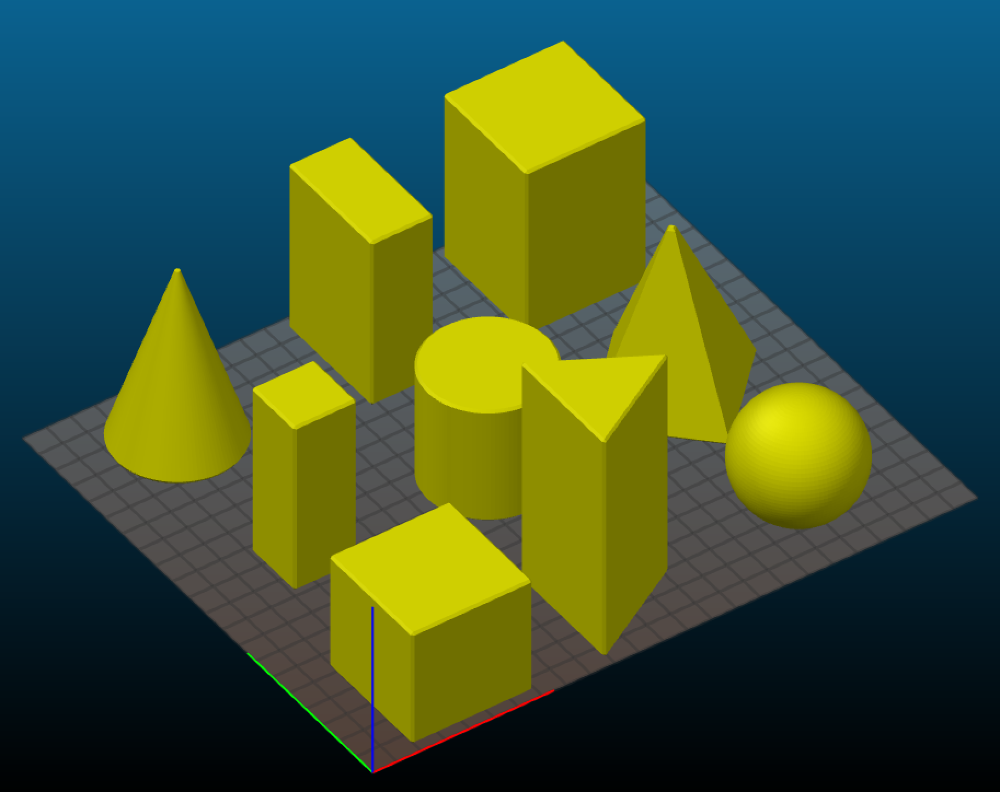

# geometric_primitives
A collection of geometric primitive shapes for educational use. Created in [OpenSCAD](http://openscad.org). Equations for the [equilateral prism](https://rechneronline.de/pi/equilateral-triangle.php) here. :-)

* sphere
* cone
* cube
* rectangles (3)
* cylinder
* pyramid
* equilateral prism

### Notes

1. A two part sphere is included (sphere2p) with a pin (spherepin) to align them. Needs no external supports to print but requires gluing the halves together. I use cyanoacrylate for PLA.
2. Cone and Pyramid have a blunt tip, for safety. I also applied a fillet to all other sharp edges. 
3. Rectangle 1 is 150% Z of square. Rectangle 2 is 50% X 50% Y 150% Z ; Rectangle 3 is 50% X 100% Y 150% Z.

### Instructions

The included STL file shapes are based on 50mm sides. I printed everything with 10% gyroid infill except spherepin, which needs none to do it's alignment job.

To make changes, you'll need to open `primitives.scad` file with OpenScad. Adjust the 'size' (in mm), which shape you want, then export as STL. If you've got the command line setup, you can run `./generate_stl.sh` to create them all automatically.

2" blocks would be 50.8mm.

### What you get

