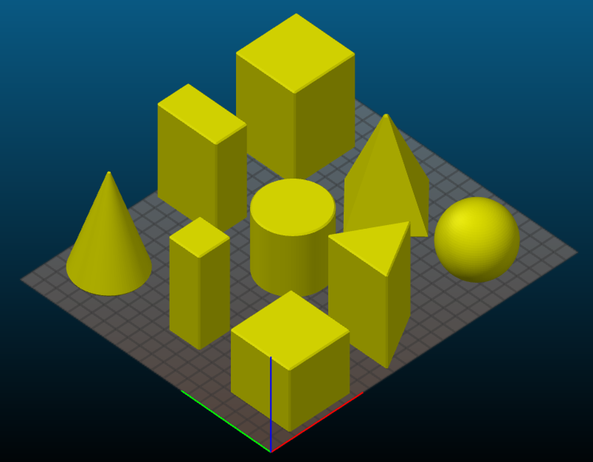

# geometeric_primitives
Seven 3D geometric primitve shapes for educational use. Created in [OpenSCAD](http://openscad.org) in maybe 10 minutes. Equations for the [equilateral prism](https://rechneronline.de/pi/equilateral-triangle.php) here. :-) 

* sphere
* cone
* cube
* rectanble (2x cube)
* cylinder
* pyramid
* equilaterial prism

Instructions:

Adjust the 'size' (in mm) and run `./generate_stl.sh`. Or just use the included STL files, which have 50mm sides.

2" blocks would be 50.8mm. 

What you get:

